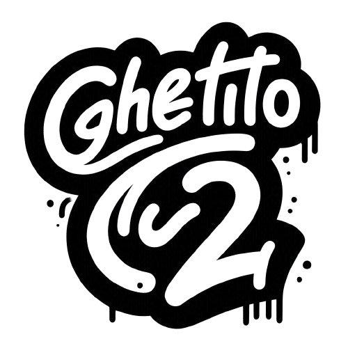
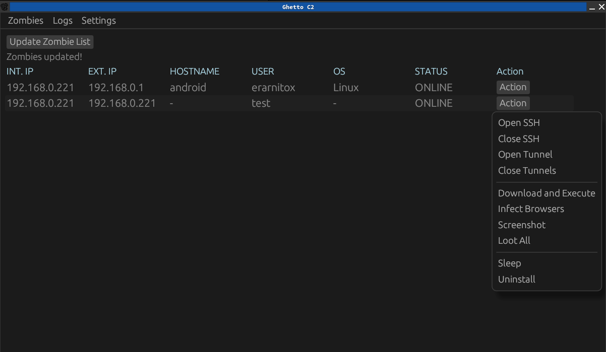
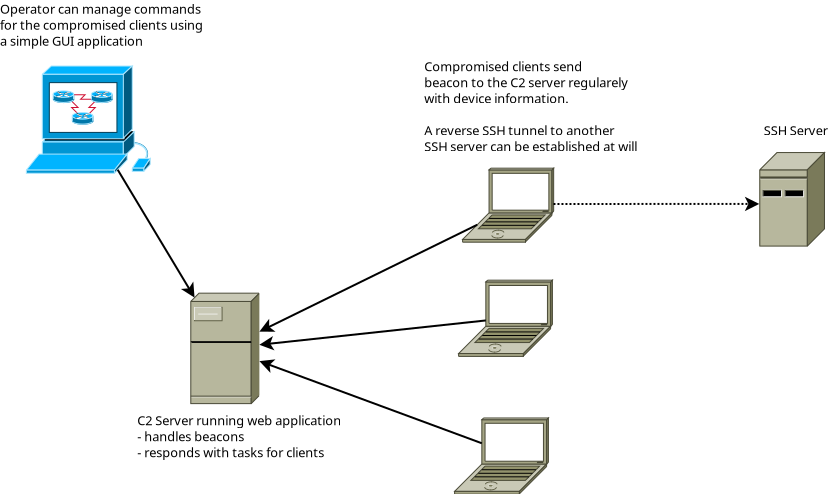

> [!WARNING]
> This is a WIP side project that is very incomplete and insecure! It is only meant to be used a playground for myself

> [!CAUTION]
> This repo will never become a fully functioning C2 framework. I don't want to release something that could be harmful. I won't assist in getting it running for you!

# Ghetto C2

Welcome to the Repository of Ghetto C2.
The worst C2 Framework written completely in Rust.

It is very incomplete right now and will never become a fully functioning C2 framework.
It will be developed on further in the future but it really only meant to be a playground for features as well as an educational resource
to learn about how a very basic C2 framework might fundamentally work.

## Installation

## Features
- can't be started. So it requires you to be able to code in order to use :)
- Yes, that's a feature not a bug!

### Architecture Overview

### Payloads
- look inside of the code!

### Security
- none

### Stealth
- not stealthy at all

## Extending
This section might be populated later if there is enough legitimate interest.

### Custom Implants
### Adding Commands

## Credits
- Me, for coding this
